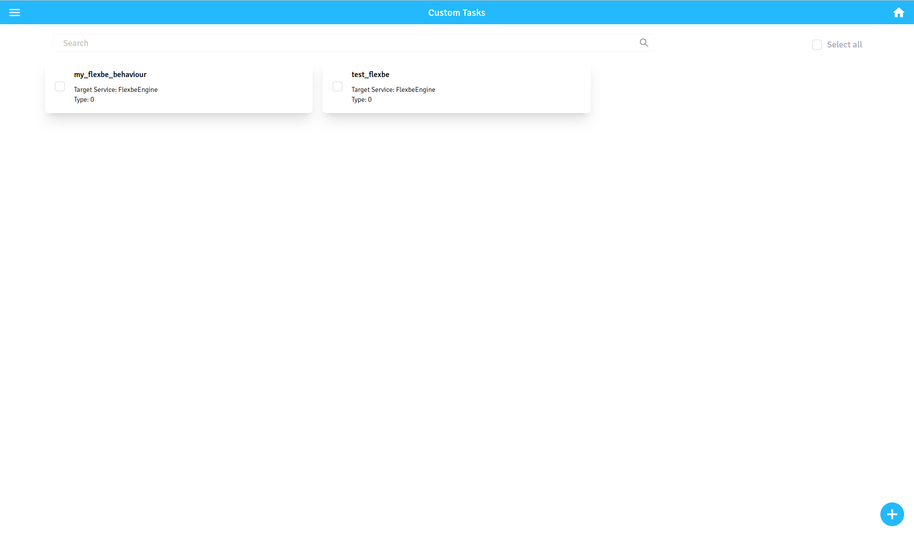
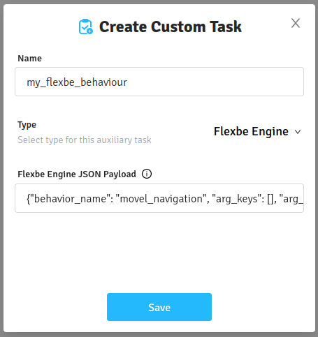
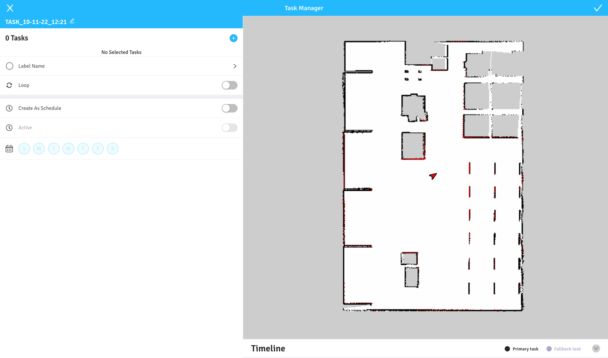
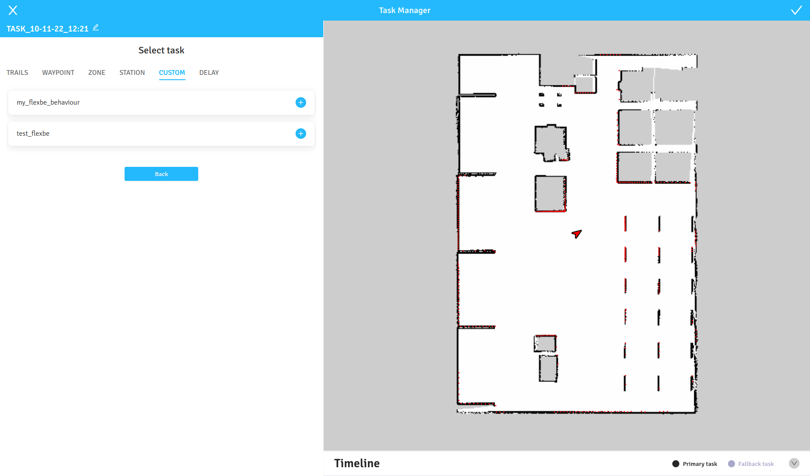
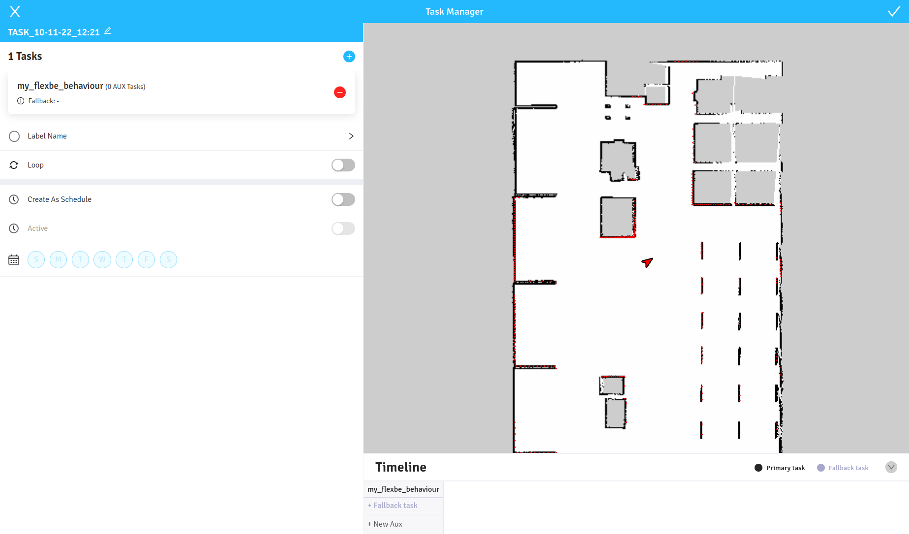
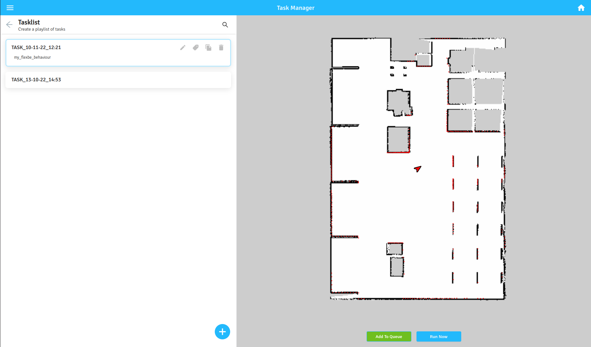

# movel_flexbe
This repo contains FlexBE states for executing Seirios RNS tasks, example behaviours, and some custom flexbe launch files.

## Installation
1. Clone this repo inside the `src` folder in a ROS workspace together with your other FlexBE states and behaviours.

```bash
$ cd your_flexbe_workspace/src
$ git clone https://gitlab.com/movelai_public/movel_flexbe.git
```
2. As a dependency for this stack, you also need to have [movel_seirios_msgs](https://gitlab.com/movelai_public/movel_seirios_msgs) pacakge installed.
3. Build the workspace.

## Usage
We provide two launchfiles to launch FlexBE behaviour engine: with and without the FlexBE app GUI. Since we are using additional config files for our states, it is recommended to use our launchfiles instead of the default ones when working with our FlexBE states.

### Without UI
The default way to use FlexBE with Seirios RNS software is running FlexBE onboard behaviour engine headless. To do that, use the flexbe_headless launch.
```bash
$ roslaunch movel_flexbe flexbe_headless.launch
```
This will launch FlexBE with an action server that interfaces with Seirios RNS.

### With UI
When creating or editing a behaviour, it is practical to use the built-in FlexBE GUI. For this, use the flexbe_full_ui launch.
```bash
$ roslaunch movel_flexbe flexbe_full_ui.launch
```
This will launch FlexBE with the usual GUI and the states will still be able to interact with Seirios RNS.
> In order to use the GUI, you must also have the FlexBE app package compiled. See [here](https://github.com/FlexBE/flexbe_app).

### Configuration File
In the movel_flexbe package is a `config` folder that contains `seirios_api.yaml`. This yaml file contains information about Seirios RNS API address and user credentials that will be used by some `movel_flexbe` states when communicating with the Seirios server.
```yaml
address: "localhost:8000"   # the API address
user:                       # Seirios RNS username for API access
  username: "movel_flexbe"
  password: "movel_flexbe"
```

## Running FlexBE with Seirios RNS
We have to enable FlexBE integration before Seirios RNS is launched. To do so, `catkin_ws/movel_ai/config/universal_handler/config` directory and edit a parameter in `universal_handler.yaml`:
```yaml
use_flexbe: true
```

FlexBE behaviours are wrapped as custom tasks in Seirios RNS. In order to execute a FlexBE behaviours, follow these steps:

1. Make sure FlexBE is running using one of the two methods above and you have your behaviour ready.

2. In Seirios RNS UI, go to "Custom Tasks" section from the top left menu, then click the "+" icon to create a new custom task.



3. Give a name to your new custom task, change the type to "Flexbe Engine", and fill in the payload (see image below). Then click "Save".



The payload format is as follows:
```json
{
  "behavior_name": "your_behavior_name",
  "arg_keys": ["arg1", "arg2"],
  "arg_values": ["123", "value"],
  "input_keys": ["input1", "input2"],
  "input_values": ["123", "true"]
}
```
Fields `arg_keys` and `arg_values` correspond to "Behavior Parameters" in FlexBE UI, and `input_keys` and `input_values` correspond to FlexBE UI's "Input Keys" in "State Machine Interface".

4. To execute a custom task from Seirios RNS, we must add the custom task to a task list. From the top left menu, go to Task Manager > Tasklist. Click "+" icon to create a new tasklist.

5. In the new task list interface, click the little "+" icon to add tasks into the tasklist.



6. Select the FlexBE task that was created previously by clicking the "+" icon next to it. You can add as many tasks as you want. When you're done, click "Back".



7. The tasklist should appear similar to the image below. To save the tasklist, click the tick mark on the upper right, then click "Save".



8. In the Tasklist page, click the tasklist, then choose either "Add to Queue" or "Run Now" to execute. Go to homepage, and if everything is configured properly, the FlexBE behaviour should be running.



## List of Available States
Details of available states are provided [here](movel_flexbe_states).